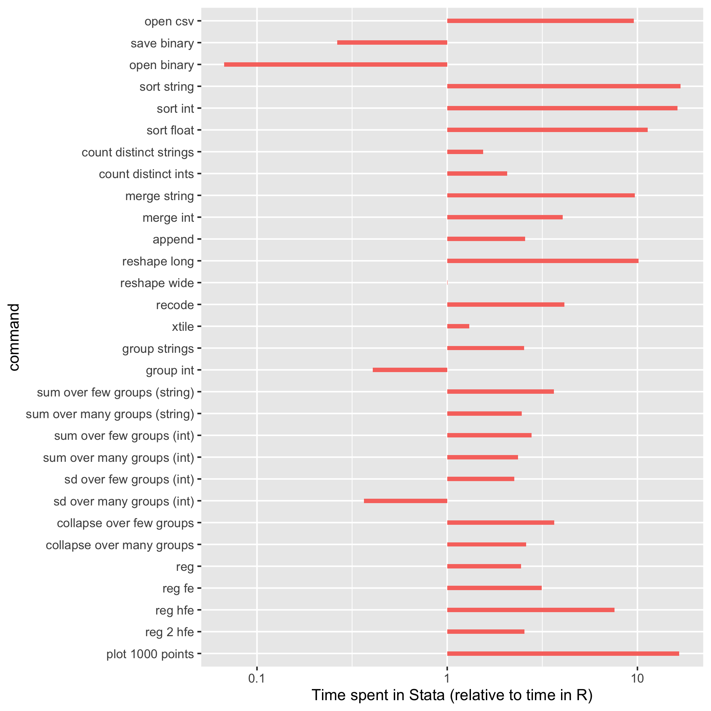
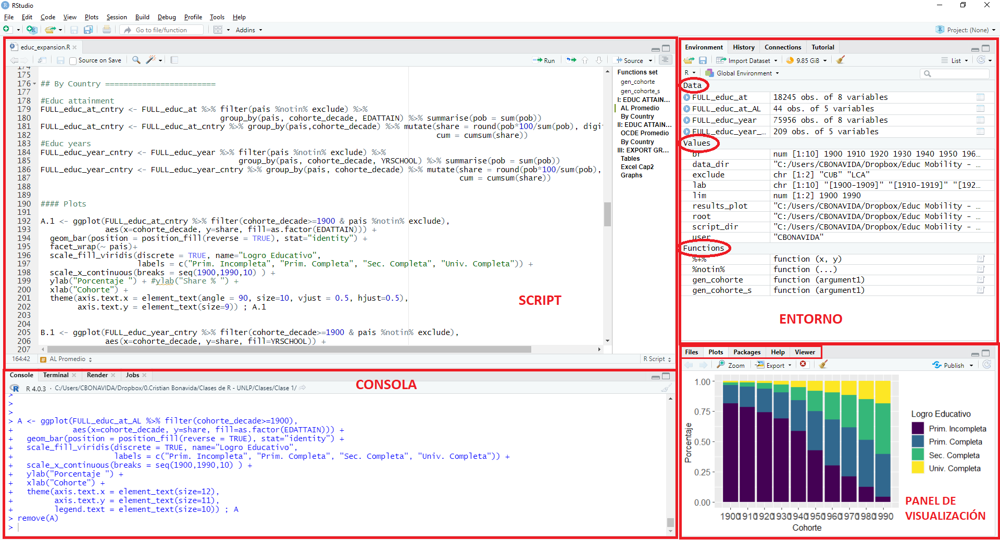
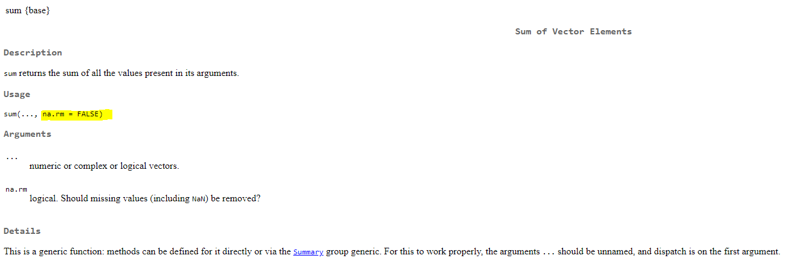

```{r xaringan-themer, include=FALSE, warning=FALSE}
library(xaringanthemer)
style_solarized_light()

```


```{r path, include=FALSE}

"%+%" <- function(x,y) paste(x,y,sep = "")         

#defino path

setwd(getwd()) 
  


```


```{r chunk_error, include=FALSE}
error_hook <- knitr::knit_hooks$get("error")
knitr::knit_hooks$set(error = function(x, options) {
  if (!is.null(n <- options$linewidth)) {
    x = knitr:::split_lines(x)
    if (any(nchar(x) > n)) x = strwrap(x, width = n)
    x = paste(x, collapse = '\n')
  }
  error_hook(x, options)
})

```


---

# ¿Qué es R?

R es un **lenguaje** y es un **software** que permite el analisis estadistico y gráfico.

-   **Lenguaje** porque tiene su propia sintaxis desde la cual escribir las sentencias y comandos

--

-   Es un **software** porque es al mismo tiempo un programa o entorno integrado con multiples funcionalidades

---

# ¿Por qué aprender R?

-   R es un programa **abierto y gratuito**. Es decir de acceso libre y que se expande con contribuciones de la comunidad de usuarios (paquetes)

-   Está especialmente enfocado en tareas de computo y analisis estadístico

-   Es tremendamente eficiente para el procesamiento de grandes volumenes de datos.

-   Es un programa muy versatil que permite utilizar la misma herramienta para una gran variedad de fines y aplicaciones


---

# ¿En el medio entre Stata y Python?

-Python es lo que se conoce como ["general-purpose programming language"](https://zims-en.kiwix.campusafrica.gos.orange.com/wikipedia_en_all_nopic/A/General-purpose_programming_language). Con Python podemos programar practicamente lo que sea, correr cualquier modelo de machine learning, crear una página web, etc

--

-R es un lenguaje del tipo ["domain-specific language (DSL)"](https://en.wikipedia.org/wiki/Domain-specific_language) porque sus funciones están pensandos para un área de uso o dominio específico. En este caso para el análisis estadístico y gráfico de manera eficiente y sucinta. R, al igual que Python se expanden muy rapidamente en sus funciones y usos y están pensados para tareas que implican un procesamiento computacional intensivo.

--

-Stata por su parte es un programa con funcionalidades muchos más especificas y acotadas. Su uso está orientado a la econometría (y al campo de la economia) y sus aplicaciones son menos versatiles. "You have one job..."


---


## Las ganancias de R

Además de ser un programa con multiples aplicaciones, R es ampliamente eficiente en el procesamiento de datos

```{r, echo=FALSE, out.width="57%", out.height="40%", fig.align="center"}



```

---

## ¿Aun más eficiente?

Como veremos luego los paquetes permiten expandir R, e incluso existen paquetes que vuelven al procesamiento de datos mucho mas eficiente respecto a la performance de base

```{r, echo=FALSE, out.width="75%", out.height="55%", fig.align="center"}

knitr::include_graphics("inputs/Clase1/dt_dplyr.jpg")

```

---

## Interface

¿Con qué nos vamos a encontrar?

```{r, echo=FALSE, out.width="100%", out.height="100%", fig.align="center"}



```

---

## Elementos Fundamentales

-   Valores

-   Vectores

-   Funciones (comandos)

-   Data Frames (base de datos)


---

## Elementos Fundamentales

-   **Valores**

-   Vectores

-   Funciones (comandos)

-   Data Frames (base de datos)

---


## Valores

Es el elemento más básico que existe en el entorno de R

-   `5` es un valor númerico

-   `5*6` es también un valor numérico

-   `"dos"` es un valor charachter

-   `"dos días"` es también un valor charachter

-   `FALSE` es un valor booleano o lógico

---

## Elementos Fundamentales

-   Valores

-   **Vectores**

-   Funciones (comandos)

-   Data Frames (base de datos)


---


## Vectores

Los vectores son una colección de valores

Para agrupar esos valores utilizamos el comando `c()`

Estos también pueden ser de distinto tipo:

```{r, echo=TRUE, eval=FALSE}

c(5, 5*6)

c("dos", "dos días")

c(5*6, "días")


```


---

## Objetos

Notar que ninguno de los valores ni vectores anteriores fueron almacenados en un objeto. Si quisiera llamarlos ¿cómo haría? 

--

**Tengo primero que definirlo!** Especificando 3 inputs:
-   nombre del objeto
-   utilizar el operador asignación `<-` (pensarlo como un `=`)
-   contenido

--

```{r, echo=TRUE, tidy=TRUE, collapse=TRUE}

objeto_1 <- 5
objeto_1

objeto_2 <- 5*6
objeto_2

objeto_3 <- objeto_1 + objeto_2
objeto_3

```


---

## Objetos

Mismo para vectores

Definir un objeto me permite luego llamarlo para distintas operaciones (lo que se concoe como vectorización)

--

```{r, echo=TRUE, size="footnotesize", collapse=TRUE}

vector_0 <- c(1, 3, 4)
vector_0

vector_1 <- vector_0 + 12
vector_1

vector_2 <- vector_0 + (12:14)
vector_2

```


---

## Objetos

Otros ejemplos con vectores del tipo character

```{r, echo=TRUE, results='hold'}

ARG_1 <- "muchaaaaaachos,"
ARG_2 <- "ahora nos volvimos a ilusionar"

ARG <- paste(ARG_1, ARG_2)
print(ARG)

```

---

## Tipos de datos

Aparte de los numéricos y character. ¿Qué otro tipo de datos existen?

```{r echo = FALSE, results = TRUE}

Nombre  <- c("Entero","Numérico","Caracter","Factor", "Logico", "Perdido", "Vacío")
Ejemplo <- c("1", "1.8", "\"uno\"" , "uno", "`TRUE`", "`NA`", "`NULL`")
Name  <- c("Integer","Numeric","Character","Factor", "Logical", "Missing", "null")

a <- data.frame(Nombre, Ejemplo, Name)
knitr::kable(a, format = "pipe", align = "c")

```

---

## Tipos de datos

¿Cómo podemos conocer qué tipos de datos son? Podemos emplear el comando `class()` de forma genérica

```{r, echo=TRUE, size="small", collapse=TRUE}

class(5)

class("ARGENTINA")

class(TRUE) 

```

---


## Tipos de datos

De la misma manera, podemos testear específicamente cada tipo de dato con el conjunto de funciones `is()`

```{r echo = FALSE, results = TRUE, size="scriptsize"}

Funcion  <- c("`is.integer()`","`is.numeric()`","`is.character()`", "`is.factor()`", "`is.logical()`", "`is.na()`", "`is.null()`")
Tipo  <- c("Entero","Numérico","Caracter","Factor", "Logico", "Perdido", "Vacío")

b <- data.frame(Funcion, Tipo)
knitr::kable(b, format = "pipe", align = "c")

```

---

## Tipos de datos


```{r, echo=TRUE, size="scriptsize", results='hold'}

is.integer(5)
is.integer("ARGENTINA")
is.character("ARGENTINA")


```


---

## Elementos Fundamentales

-   Valores
-   Vectores
-   **Funciones** (comandos)
-   Data Frames (base de datos)

---

## Funciones

Ya sabemos para que sirve `is.interger()`, `class()`, también usamos un ejemplo con `paste()`

Ahora, estos elementos no son ni valores, ni vectores. ¿Qué son?


---

## Funciones

Las funciones son comandos, son expresiones que encierran una orden predeterminada. 

Al invocar una función le estaremos diciendo a R que realice una tarea particular. 

Para ejecutar una función R necesita de dos inputs:

- Nombre de la función
- Argumento 

--

```{r, echo=TRUE, results='hold'}

class(5)   # "class" es el nombre de la función
           # 5 es el argumento

```


---

## Funciones

Existen interminables tipos de funciones. De las mas simples a las mas complejas. Sea cual fuera la función, siempre, los argumentos están predefinidos. Los argumentos pueden ser

 - Opcionales
 - Requeridos
  
Si pasamos una función y nos falta algún argumento requerido, R no podrá completar la tarea

```{r, echo=TRUE, error=TRUE, tidy=TRUE, linewidth=50}

strsplit(x="CAMPEONES DEL MUNDO - 2022")

```


---

## Funciones

Para dividir el texto, la función requiere un argumento **obligatorio** que indique el patrón que separa en dos la expresión

```{r, echo=TRUE, error=TRUE}

strsplit(x="CAMPEONES DEL MUNDO - 2022", split="-")

```


---
class: title-slide, top, left, inverse
background-image: url("inputs/Clase1/messi_copa.jpg")
background-size: cover

## Funciones

Y el siguiente comando funcionaría? 

Aparte del fondo, qué otra diferencia notan respecto de la slide anterior...

```{r, echo=TRUE, eval=FALSE}

strsplit("CAMPEONES DEL MUNDO - 2022", "-")

```

--

```{r, echo=FALSE}

strsplit("CAMPEONES DEL MUNDO - 2022", "-")

```

--

Sí, porque los argumentos pueden indicarse en orden, ahorrandonos tener que llamarlos explicitamente. R entiende solo a qué no referimos


---

## Funciones

Los argumentos tienen valores por default, es decir por omisión. La función esta setteada de manera que, si no indico lo contrario, el argumento tomará una valor por default. 

```{r, echo=TRUE, size="scriptsize", results='hold'}

valores <- c(5, 25, 65, NA, 110, 220)
sum(valores)
sum(valores, na.rm=TRUE)

```

La función `sum()` incluye los valores `NA` en la suma, ya que por default el argumento `na.rm` es `FALSE`. Por eso el resultado arrojado será también `NA`. Para cambiar ese comportamiento tengo que explicitar el argumento como `TRUE`

---

## Funciones

Otro ejemplo

```{r, echo=TRUE, size="scriptsize", results='hold'}

pi <- 3.141592653
pi_inter <- round(pi) 
pi_inter


```

--

En este caso, no explicitamos el argumento `digits()` en la función, el cual indica cuántos decimales incluir. El valor por omisión es 0

```{r, echo=TRUE, size="scriptsize", results='hold'}

pi_decim <- round(pi, digits = 2) 
pi_decim 


```


---

## Funciones

Cómo hacemos para saber cuales son los argumentos de cada función y cuáles son sus valores por default. 

Al igual que en stata, tenemos un comando como el help. 

```{r, eval=FALSE}

?sum()

```




---


## Funciones

Además de la documentación completa, también podemos  darle una mirada rápida a la función desde la consola directamente. Esto resulta muy practica cuando estamos escribiendo el código y lo que necesitamos es "refrescar la memoria"

  


---

## Funciones

Como veremos mas adelante, en R es sencillo y de gran ayuda crear nuestras propias funciones, según lo que necesitemos hacer.

Por suerte, existe una enorme comunidad de usuarios, quienes ya desarrollaron un infinidad de funciones las cuales podemos aprovechar.


---


## Paquetes

Cuando instalamos R, el programa ya trae una serie de funciones `base`. Una de las grandes ventajas de R, es que puede expandirse en sus usos y aplicaciones a partir de otros paquetes. 

Los paquetes no son otra cosa que un *wrap* o grupo de funciones, que tienen una aplicación común o que sirven para realizar un conjunto de tareas similares. 

Pueden pensarlas como funciones agrupadas por temática de uso

Por ejemplo, el paquete `"stringr"` incluye funciones para trabajar con *strings*


---

## Paquetes

Para poder usar un paquete hay que hacer dos cosas. 

- Instalarlo
- Cargarlo

```{r, eval=FALSE}

install.packages("stringr")   #instalo
library(stringr)              #cargo

```

Listo!


---

## Paquetes

El cuidado que debemos tener es que, la haber tantos paquetes, el mismo nombre o similar puede referir a funciones de paquetes distintos. 

Nuevamente, la información desde la consola nos ayuda a saber cuás es cuál y a elegir la función deseada


---

## Paquetes

La mejor forma de asegurarnos que estamos usando la función del paquete que queremos, es llamar primero al paquete y luego elegir dentro de él, la función buscada. 

Para eso escribimos el nombre del paquete seguido de "::"


```{r, eval=FALSE}

stringr::str_split()

```

---

## Elementos Fundamentales

-   Valores
-   Vectores
-   Funciones 
-   **Data Frames** (bases de datos)


---

## Data Frames

Un data frame es el elemento más tipico para trabajar con datos. 

Es una estructura de datos **tabular**, es decir ordenados en **columnas** (variables) y **filas** (observaciones). 

Un dataframe es un conjunto de vectores, los cuales pueden ser de **distinto tipo**, pero que deben ser de de la **misma longitud**


---

## Data Frames

Voy a crear un objeto llamado "df" a partir de vectores con el comando `data.frame()`

```{r, echo=TRUE, size="footnotesize", tidy=TRUE, eval=TRUE}

sede <- c("Alemania", "Sudáfrica", "Brasil", "Rusia", "Qatar")
año <-  seq(2006, 2022, 4)  
campeon <- c("Italia", "España", "Alemania", "Francia", "Argentina")
publico <- c(69000, 84490, 74738, 78000, 88966)
penales <- c(TRUE, FALSE, FALSE, FALSE, TRUE)

df <- data.frame(sede, año, campeon, publico, penales)

```

--

```{r, eval=TRUE, include=FALSE}

sede <- c("Alemania", "Sudáfrica", "Brasil", "Rusia", "Qatar")
año <-  seq(2006, 2022, 4)  
campeon <- c("Italia", "España", "Alemania", "Francia", "Argentina")
publico <- c(69000, 84490, 74738, 78000, 88966)
penales <- c(TRUE, FALSE, FALSE, FALSE, TRUE)

df <- data.frame(sede, año, campeon, publico, penales)

```


---

## Data Frames

```{r, echo=FALSE}

knitr::kable(df, format = "pipe", aling="c")

```

---

## Data Frames

Inspeccionando el dataframe 

- Cual es la dimensión de este dataframe?

--
- Cuales son los nombres de las variables?

--
- Cuantas filas tiene? 

--
- De qué clase es?

```{r, tidy=TRUE, size="small", collapse=TRUE}

dim(df)
names(df)
nrow(df)
class(df)

```


---

## Subconjuntos

Algo MUY importante, es saber cómo **navegar por un dataframe o por un vector** 

Esto me va a permitir generar subconjuntos de datos, definir nuevos elementos, operar sobre ellos, etc

--

Por ejemplo, ¿cómo hago para **llamar a un elmento** de un vector?

--

Debeo indicar el *orden* del elemento

```{r, tidy=TRUE, size="small", collapse=TRUE}

actual <- campeon[5]
actual

```


---

## Subconjuntos

Obvimaente, puedo llamar a mas de un elemento a la vez.

--

Por ejemplo si quisiera saber cuál son **los últimos dos** campeones

```{r, tidy=TRUE, size="small", collapse=TRUE}

ultimos_2 <- campeon[4:5]
ultimos_2

```

---

## Subconjuntos

¿Cómo hago para **quitar** el elemento del medio?

--

```{r, tidy=TRUE, size="small", collapse=TRUE}

out_ger <- campeon[-3]
out_ger

```

--


Supongamos que la cantidad de público en Rusia fue de 88000 y no 78000. Se les ocurre cómo hago para **modificar el valor**?

--

```{r, tidy=TRUE, size="small", collapse=TRUE}

publico[4] <- 88000
publico

```


---

## Subconjuntos

¿Cómo hago para sumar la cantidad de espectadores en las dos ultimas ediciones?

--

```{r, tidy=TRUE, size="footnotesize", collapse=TRUE}

suma_pub_v1 <- publico[4] + publico[5]
suma_pub_v1

suma_pub_v2 <- sum(publico[4], publico[5])
suma_pub_v2

suma_pub_v3 <- sum(publico[4:5])
suma_pub_v3

suma_pub_v1==suma_pub_v2
suma_pub_v2==suma_pub_v3
```


---

## Subconjuntos

Si qusiera extraer el elemento 1 y 5 del vector... esto estaría bien?


```{r, eval=FALSE, size="small"}

prueba <- campeon[1,5]


```

--

```{r, echo=FALSE, error=TRUE, tidy=TRUE, linewidth=50}

prueba <- campeon[1,5]

```

--

Porque los vectores son elementos unidimensionales y la coma le indica a R, que estamos buscando elementos en dos dimensiones. En este caso **1 refiere a la fila y 5 a la columna**

`df[fila, columna]`


---

## Subconjuntos

Para definir un nuevo vector con el elemento 1 y 5 del vector de campeones tengo que usar el constructor que ya vimos: `c()`

```{r, echo=TRUE, error=TRUE, tidy=TRUE, linewidth=50}

prueba <- c(campeon[1], campeon[5])
prueba

```


---

## Subconjuntos

Con esto en mente: `df[fila, columna]`

Ahora veamos cómo acceder a elementos del data frame 

--

Quiero traer **TODAS LAS OBSERVACIONES** de la fila "penales", que es la última fila


```{r, echo=TRUE, size="small", collapse=TRUE}

prueba1 <- df[,5]
prueba1

prueba2 <- df[,"penales"]
prueba2

```

--

Si en fila no indico nada, R entiende que quiero traer todas las filas de esa columna


---

## Subconjuntos

Ahora traigamos **la primer fila** de la misma columna "penales"

```{r, echo=TRUE, size="small", collapse=TRUE}

prueba1 <- df[1,5]
prueba1

prueba2 <- df[1,"penales"]
prueba2

```


---

## Subconjuntos

Ahora solo la **primer fila**, pero con **todas las columnas**

```{r, echo=TRUE, size="small"}

prueba <- df[1,]
prueba

```


---

## Repaso


---

## Operador $

Por qué es necesario indicar siempre df?

--

Porque a diferencia de stata, **podemos tener el entorno de trabajo multiples data frames definidos** y por tanto para llamar al elemento primero debo llamar a dataframe:

--

```{r, echo=FALSE, out.width="45%", out.height="25%", fig.align='center'}

knitr::include_graphics("inputs/Clase1/index_1.png")

```

--

Existe otra manera, muy usada en R de hacer esto: el simbolo `$`

--

```{r, echo=FALSE, out.width="45%",  out.height="15%", fig.align='center'}

knitr::include_graphics("inputs/Clase1/index_2.png")

```


---

## Operador $

Partimos desde el dataframe y luego indicamos la columna:

`data.frame()` >> `columna` 

O lo que es lo mismo:

`data.frame()` >> `vector` 


--

```{r, echo=TRUE, size="small"}

df$penales

```

---

## Operador $

De la misma manera que haciamos antes

--

```{r, echo=FALSE, out.width="45%", out.height="25%", fig.align='center'}

knitr::include_graphics("inputs/Clase1/index_3.png")

```

--

el operador `$` nos permite traer un elemento particular

--

```{r, echo=FALSE, out.width="45%",  out.height="15%", fig.align='center'}

knitr::include_graphics("inputs/Clase1/index_4.png")

```


---

## Operador $

Partimos desde el dataframe y podemos llegar hasta una observación puntual:

`data.frame()` >> `columna` >> `observación`

O lo que es lo mismo:

`data.frame()` >> `vector` >> `valor`

--

```{r, echo=TRUE, size="small"}

df$penales[1]

```


---

## Filtrar observaciones

Muchas veces lo que queremos hacer no es traer una observación puntual, sino todas aquellas que cumplen con una condición. Es decir que queremos *filtrar* nuestros datos

--

La regla es la de siempre: `df[fila, columna]`

--

Vimos que esto nos traía todas las filas

```{r}
df[,]
```

--
Porque no especificabamos nada antes de la coma. 

---

## Filtrar observaciones

`df[fila, columna]`


En la posición de las filas es donde ahora debemos pasarle la condición. Para ello debo indicar:

- sobre qué variable voy a buscar que se den determinadores valores
- cual es, o cuáles son, esos valores

--

Por ejemplo, si quiero quedarme con todos los mundiales donde la final se definió por penales:

```{r}

df[df$penales==TRUE,]

```


---

## Filtrar observaciones


Si queremos las observaciones para los mundiales donde el público fue mayor a 75 mil espectadores


```{r}

df[df$publico > 75000,]

```


---

## Filtrar observaciones

Notar que en los anteriores casos estoy llamando a las filas que cumplen la condición y a *todas la columnas del dataframe* 

--

Si ahora quisiera saber cuál fue la sede del Mundial cuando el campéon fue España, ¿Cómo harían?

Piensen de nuevo en `df[fila, columna]`

--

```{r}

df[df$campeon=="España", "sede"]
```
--

La orden: 

*Del dataframe `df` quedate con las filas donde el valor de la columna `campeon` sean iguales a "España" y para esas observaciones traeme el valor que toma la columna `sede`*

---

## Filtrar observaciones

¿Se les ocurre otra forma?

--

```{r}

df$sede[df$campeon=="España"]

```
--

La orden: 

*Del dataframe `df` traer la columna `sede`, cuando los valores de la columna `campeon` sean iguales a `"España"`*


